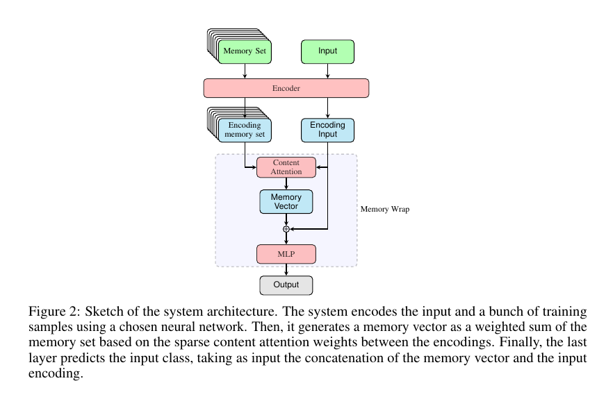
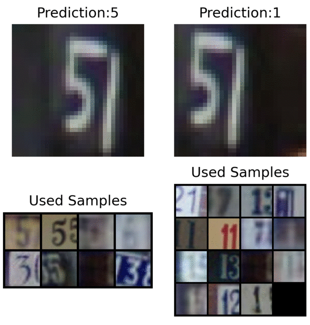
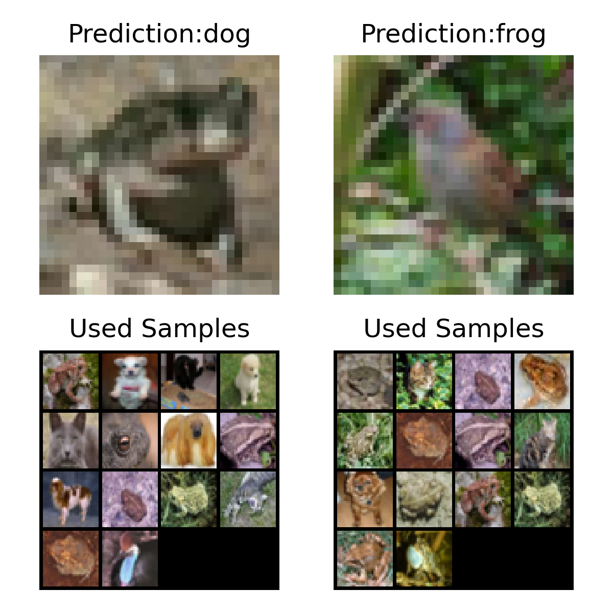
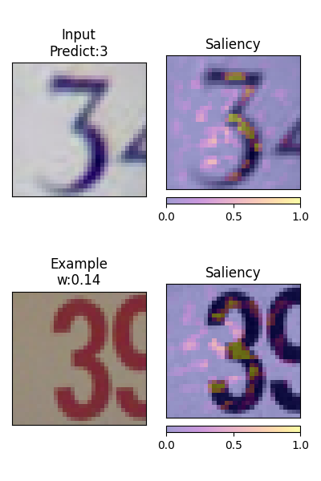
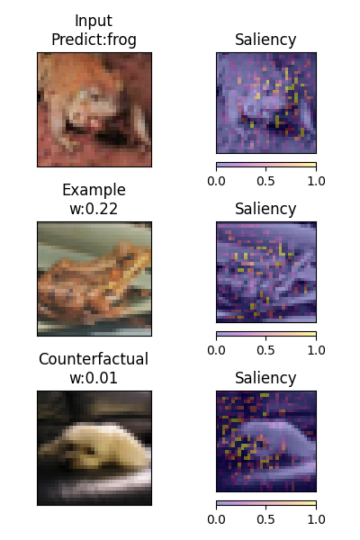

# Memory Wrap
Official repository of the paper "Memory Wrap: a Data-Efficient and Interpretable Extension to Image Classification Models. *Biagio La Rosa, Roberto Capobianco and Daniele Nardi.*"

The repository contains the PyTorch code to replicate paper results and a guide to use Memory Wrap in your own projects.
## Description
Memory Wrap is an extension to image classification models that improves both data-efficiency and model interpretability, adopting a sparse content-attention mechanism between the input and some memories of past training samples.



 Memory Wrap outperforms standard classifiers when it learns from a limited set of data, and it reaches comparable performance when it learns from the full dataset. Additionally, its structure and content-attention mechanisms make predictions interpretable, compared to standard classifiers.
# Library
## Installation
This repository contains a PyTorch implementation of Memory Wrap. To install Memory Wrap run the following command:
```
pip install memorywrap
```

The library contains two main classes:
- *MemoryWrapLayer*: it is the Memory Wrap variant described in the paper that uses both the input encoding and the memory encoding to compute the output;
- *BaselineMemory*: it is the baseline that uses only the memory encoding to compute the output.

## Usage
### Instantiate the layer
```python
memorywrap = MemoryWrapLayer(encoder_dim,output_dim,mlp_activation=torch.nn.ReLU())
```
or
```python
memorywrap = BaselineMemory(encoder_dim,output_dim,mlp_activation=torch.nn.ReLU())
```
where:
- *encoder_dim* is the output dimension of the last layer of the encoder 
- *output_dim* is the desired output dimensione. In the case of the paper *output_dim* is equal to the **number of classes**;
- *mlp_activation* is the activation that must be used in the hidden layer of the multi-layer perceptron. By default is the ReLU function.

### Forward call
Add the forward call to your forward function.
```python
output_memorywrap = memorywrap(input_encoding,memory_encoding,return_weights=False)
```
where *input_encoding* and *memory_encoding* are the outputs of the the encoder of rispectively the current input and the memory set, and *return_weights* is a flag telling to the layer if it has to also return the sparse content weights. If you have set the flag *return_weights* to True, then *output_memorywrap* is a Tuple where the first element is the output and the second one are the content weights associated to each element in the memory_encoding.


# Jupyter Notebook
You can find in the <a href="https://colab.research.google.com/drive/1OPjcpTH7X8EV1ev361iuhVzd2Jfp9kFA">following link </a> a jupyter noteebook that explains step by step the process of extending a deep neural network with Memory Wrap.

# Paper Code
To replicate paper results please consult the directory "paper" and the associated README.md. The directory contains all the scripts needed to download the datasets, run the scripts and replicate the results.

# Results

## Performance
MobileNet-v2 Mean Accuracy

| Dataset | Variant        | 1000  | 2000 | 5000 | Full |
| ------------------ | ------------------ |---------------- | -------------- | -------------- | -------------- |
|SVHN| Std   |      42.71       |     70.87        | 85.52 | 95.95 |
|| Memory Wrap   |     **66.93**         |       **81.44**      | **88.68** | 95.63 |
|CIFAR10| Std   |    38.57         |    50.36         | 72.77 | 88.78|
|| Memory Wrap   |    **43.87**          |     **57.12**        | 75.33 | 88.49 |
|CINIC10| Std   |     29.61        |       36.40      | 50.41 |78.85 |
|| Memory Wrap  |      **32.34**        |    **39.48**         | **52.18**  |78.88 |


## Explanatory Images

### Memory Images
They show the samples in the memory set that actively contribute to the prediction of the deep neural network. <br>



### Explanation by examples, counterfactuals, and their attribution
Images showing the current input, a similar sample classified in the same class (explanation by example) and a similar sample classified in a different class (counterfactual).<br>



# Referenced repositories and libraries
- Implementantion of the architectures are taken from Kuangliu repository:
<a href="https://github.com/kuangliu/pytorch-cifar">https://github.com/kuangliu/pytorch-cifar</a>
- The <a href="https://captum.ai/">Captum library</a> has been used to apply the Integrated gradients method.

# Citation
Please cite our paper as:
```tex
@article{LaRosa2021,
title={Memory Wrap: a Data-Efficient and Interpretable Extension to Image Classification Models},
author={Biagio La Rosa and Roberto Capobianco and Daniele Nardi},
journal={arXiv preprint arXiv:2106.01440},
year={2021}
}
```